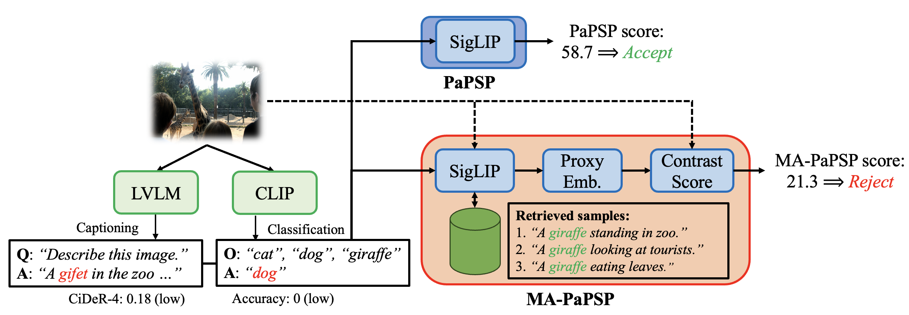

---
hide:
  - navigation
  - toc
---

# Aditya Sarkar { align=right style="width:7.5em; margin-left: 7.5em; margin-top: 0.5em; border-radius: 1em;"}

:fontawesome-solid-building: Office: [4112-D15, Brendan Iribe Center, 8125 Paint Branch Dr, College Park, MD 20742](https://maps.app.goo.gl/xWjQWVVnpTVoWaQw8)

:fontawesome-solid-inbox: Work Email: [asarkar6 [at] umd [dot] edu](mailto:asarkar6@umd.edu)

:fontawesome-solid-inbox: Personal Email: [asnov2k [at] gmail [dot] com](mailto:asnov2k@gmail.com)

[:academicons-google-scholar:](https://scholar.google.com/citations?user=jLJJn6sAAAAJ&hl=en) [:fontawesome-brands-linkedin:](https://www.linkedin.com/in/aditya-sarkar-970620315/) [:fontawesome-brands-github:](https://github.com/kingston-aditya) [:fontawesome-brands-x-twitter:](https://x.com/sarkar8073) [:fontawesome-solid-chalkboard-user:](SanDiego_Aditya_CV8.pdf)

 

Hello! I am a second-year Ph.D. student at the [__University of Maryland__](https://www.umiacs.umd.edu/), where I am engaged in research collaborations with Profs. [__Nuno Vasconcelos__](http://www.svcl.ucsd.edu/people/nuno/) and [__David Jacobs__](https://www.cs.umd.edu/~djacobs/). My research aims to build better computer vision algorithms, specifically for temporal understanding in LLMs, action and world modeling. I am grateful to be supported by University of Maryland __Graduate Fellowship__.

In my free time, I document my readings on my blog __Mind Unknotted__. Feel free to check it out [here](blog.md). 

I am looking for research internships for summer '26. Please reach out if you're interested in my profile.

<!-- ## News

=== "2026"
    
    [01/2026] :party_popper: MA-PaPSP got accepted at ICLR '26. See you in Rio de Janeiro, Brazil.

=== "2024"

    [09/2024] :party_popper: Excited to start my Ph.D. at [University of Maryland](https://umd.edu/) advised by Prof. [Ang Li](https://www.ang-li.com/).

    [09/2023] :party_popper: Graduated from IIT Mandi with B.Tech. (Honors) in Electrical Engineering. -->

## Publications
\* denotes equal contribution

<!-- === "Publications" -->

####Masked Visual Fine-Tuning for Encoder-based Diffusion Models.

<u>Aditya Sarkar</u>, [Shwai He](https://shwai-he.github.io/), [Jiacheng Cheng](), [Yi Li](http://www.svcl.ucsd.edu/people/yili/), [Shlok Mishra](https://shlokk.github.io/shlokmishra.github.io/), [Ang Li](https://www.ang-li.com/), [David Jacobs](https://www.cs.umd.edu/~djacobs/), [Nuno Vasconcelos](http://www.svcl.ucsd.edu/people/nuno/).

Preprint&nbsp;&nbsp;[:academicons-arxiv: arXiv]()&nbsp;&nbsp;[:fontawesome-solid-link: Project Page]()

####An Attribute-Based Measure of Video Complexity.

<u>Aditya Sarkar</u>, [Yi Li](http://www.svcl.ucsd.edu/people/yili/), [Z. Wang](), [J. Cheng](https://jiacheng-cheng.github.io/), [V.N. Sai](), [Aashu Singh](), [Shlok Mishra](https://shlokk.github.io/shlokmishra.github.io/), [David Jacobs](https://www.cs.umd.edu/~djacobs/), [Nuno Vasconcelos](http://www.svcl.ucsd.edu/people/nuno/).

Preprint&nbsp;&nbsp;[:academicons-arxiv: arXiv]()&nbsp;&nbsp;[:fontawesome-solid-link: Project Page]()

####Leveraging Data to Say No: Memory Augmented Plug-and-Play Selective Prediction{align=right style="height:8em; border-radius: 1em;"}

<u>Aditya Sarkar</u>, [Yi Li](http://www.svcl.ucsd.edu/people/yili/), [Jiacheng Cheng](https://jiacheng-cheng.github.io/), [Shlok Mishra](https://shlokk.github.io/shlokmishra.github.io/), [Nuno Vasconcelos](http://www.svcl.ucsd.edu/people/nuno/).

ICLR 2026 &nbsp;&nbsp;[:academicons-arxiv: arXiv](https://arxiv.org/pdf/2601.22570)&nbsp;&nbsp;[:fontawesome-solid-link: Project Page](mapapsp.html)

## Blog

####(June 14, 2026) - Hallucination detection versus Selective prediction.

####(April 30, 2026) - Quantifying video complexity using Vector Quantization.

 